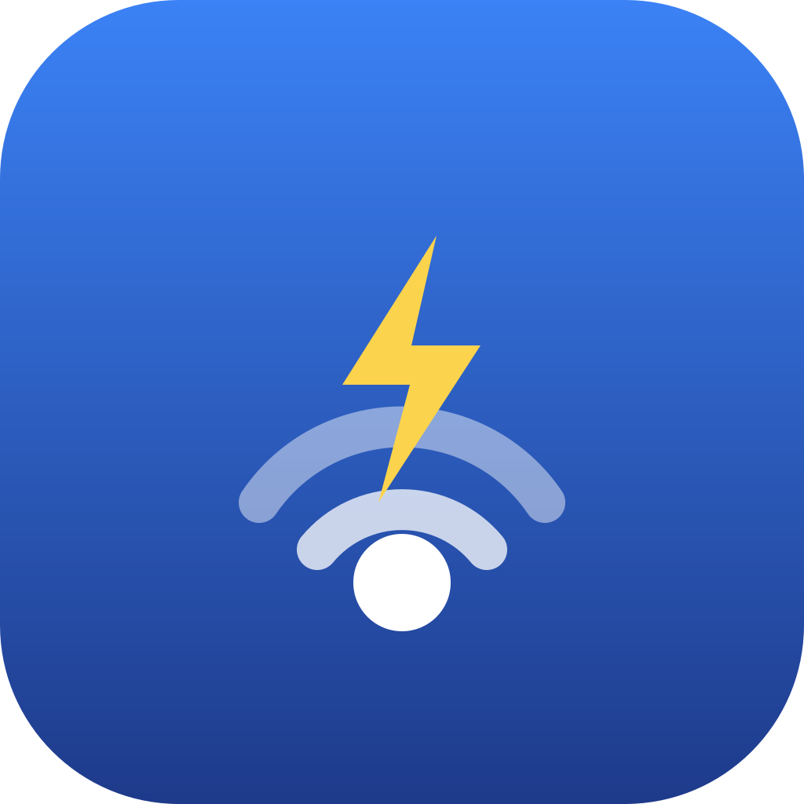

# LTE Guard

<p align="center">
  
</p>

<p align="center">
  <b>Mac 合盖睡眠后 USB 网卡断联？醒来自动修好，不用再拔插。</b><br>
  <sub>常驻菜单栏的 USB 网卡守护工具 · Swift 原生 · 零依赖 · MIT</sub>
</p>

<p align="center">
  <b>简体中文</b> · <a href="README.en.md">English</a> · <a href="README.ja.md">日本語</a> · <a href="README.de.md">Deutsch</a> · <a href="README.fr.md">Français</a> · <a href="README.es.md">Español</a> · <a href="README.ru.md">Русский</a> · <a href="README.ar.md">العربية</a> · <a href="README.rw.md">Ikinyarwanda</a>
</p>

---

## 问题

不少 USB LTE 上网卡 / USB 有线网卡在 Mac 合盖睡眠后会"假死"：指示灯还亮着、系统里接口也在，但就是不通网，**必须拔下来重插一次**才恢复。

原因是睡眠时 macOS 不切断 USB 供电（VBUS 由 SMC 固件直管，软件无法关闭），设备侧的 USB 会话却已失效——重启网络服务没用，因为要重置的是 USB 层。

## 谁会用到

只要 Mac 靠 **USB 外接网卡上网**，就可能撞上这个问题：

- 🚁 **无人机图传改 LTE** —— DJI 一代图传改蜂窝回传等玩法，Mac 端插 4G/5G 上网卡长时间值守
- 📡 **USB LTE / 4G / 5G 上网卡、随身 WiFi、USB 蜂窝模块** —— 户外作业、车载、船载、展会、临时办公
- 🔌 **USB-C / Thunderbolt 转以太网适配器** —— Mac 没有网口，接会议室、机房、客户现场的网线
- 🧩 **扩展坞 / Dock 里的网卡** —— Belkin、Plugable、Anker、绿联、CalDigit 等
- 🎥 **依赖稳定上行的直播、RTMP 推流、远程运维**
- 🖥 **软路由 / 树莓派 / 工控设备通过 USB 网卡直连 Mac 调试**

共同点：合盖一次，回来就断网，指示灯还亮着，**只能拔了重插**。

### 不止网卡

同样的"睡醒后假死、只能物理拔插"在其他 USB 设备上也很常见——[Apple 官方社区](https://discussions.apple.com/thread/7745583)、[MacRumors](https://forums.macrumors.com/threads/mac-mini-m1-usb-ports-not-working-after-wake-from-sleep.2326616/)、[Plugable 知识库](https://kb.plugable.com/docking-stations-and-video/devices-are-not-detected-after-waking-from-sleep-or-after-rebooting-on-macos)都有大量记录：音频接口、摄像头、外置硬盘、读卡器、扩展坞上的各个组件都会中招。

因为底层机制相同，本工具的菜单里提供了 **「重置 USB 设备」**：列出当前所有 USB 设备，选一个就能对它做软件拔插，不必伸手去拔线。网卡之外的设备目前需要手动触发（自动检测只覆盖网络，因为"通不通"有明确的判定标准，而摄像头、音频接口很难自动判断是否假死）。

> ⚠️ 对外置硬盘等存储设备使用前，请先停止读写并推出，否则可能损坏数据。

## 如果你是搜索着找过来的

下面这些是各个论坛里真实出现过的提问措辞。如果你正因为其中任何一句而搜索，那本工具就是为你写的。

### 中文社区里大家是怎么问的

> 外置有线网卡唤醒时失效 · 睡眠唤醒后扩展坞需要重新插拔才能用 · Mac 休眠后再唤醒就不认外接的移动硬盘了 · 休眠重启后键盘失灵要重新插拔 USB 线才恢复 · MacBook 使用绿联 TypeC 网卡锁屏睡眠后断网 · 螃蟹 8153 网卡休眠唤醒后大概率失效 · 网卡在设置里显示"未连接" · 合盖再打开就没网了 · 指示灯还亮着但上不了网 · 接口还在但 ping 不通 · 拔了重插才能恢复 · Mac 睡眠唤醒后网线没反应 · USB-C 转以太网适配器休眠后失效 · 扩展坞网口睡醒不通 · LTE 上网卡合盖后掉线 · 4G 随身 WiFi 唤醒后无法上网 · 外接声卡休眠后不识别 · 摄像头睡眠唤醒后消失 · 读卡器唤醒后读不到 · Mac mini 睡眠后 USB 口全部失灵

### 英文社区里的原始标题

以下均为 Apple 官方社区、MacRumors 等处的真实帖子标题，一字未改：

> `Ethernet USB-C adapter doesn't wake up after sleep` · `Ethernet adapter doesn't want to wake up after sleep` · `Usb ethernet adapter is not working after sleep` · `Ethernet not waking after sleep` · `Ethernet reset/disconnect on wake-up` · `Ethernet disconnected after sleep` · `MacBook Air 2020 USB LAN issue after sleep` · `USB devices aren't working after waking from sleep` · `USB A ports no power after wake up` · `Mac Mini M1 — USB Ports not working after wake from sleep` · `USB device does not wake up after sleep` · `Hardwired internet via a USB hub is not working after the MBP sleeps` · `Devices are not detected after waking from sleep or after rebooting on macOS` · `Ethernet connection downgraded while asleep` · `Loosing Ethernet connection nearly every day` · `After updating to macOS Tahoe external USB devices disconnect after sleep` · `USB ports NOT working after macOS Tahoe` · `AX 88179a Ethernet Adapter not recognized` · `macOS 26 Third Party Ethernet Support` · `Mouse freezes after macOS Tahoe 26.5`

常见搜索词组合：

> `usb ethernet adapter not working after sleep mac` · `macbook ethernet doesn't wake up after sleep` · `usb-c ethernet adapter stops working after lid close` · `mac dock ethernet not detected after wake` · `lte modem disconnects after macbook sleeps` · `have to unplug and replug ethernet adapter macos` · `usb device dead after wake macos` · `thunderbolt dock ethernet not working after sleep` · `external drive not mounting after sleep mac` · `usb hub stops working after sleep macbook` · `macos re-enumerate usb device without unplugging` · `software unplug usb mac` · `reset usb port macos command line`

### 按设备分类

| 你的设备 | 常见描述 |
|---|---|
| USB 网卡 / 有线网卡 | 灯亮但没网、显示"未连接"、`en5` 还在但 ping 不通、要拔了重插 |
| LTE / 4G / 5G 上网卡、随身 WiFi | 合盖后掉线、唤醒后无法上网、需要重新插拔才能拨号 |
| 扩展坞 / Dock（Belkin、Plugable、Anker、绿联、CalDigit、OWC） | 睡醒后坞上设备全都不认、要拔掉整个坞再插 |
| 外置硬盘 / SSD | 休眠后不挂载、提示"磁盘未正确推出"、要重插才出现 |
| 摄像头 / 采集卡 / 声卡音频接口 | 唤醒后设备列表里消失、软件里选不到 |
| 读卡器 / 加密狗 / 键鼠 | 唤醒后无响应、要拔插一次才恢复 |

### 常见芯片型号（论坛里被点名最多的）

> ASIX `AX88179` / `AX88179A` · Realtek `RTL8153`（中文社区常称"螃蟹 8153"）· `RTL8156` 2.5G · Quectel `EC25` · 各类 `CM3xx` 系列 · Intel `I225-V`（经雷雳扩展坞）

### 十年了，还没修好——而且最新版更严重

这不是一个"老早修掉了"的陈年问题。把公开求助按时间排开会看到一条从未断过的线：

| 时期 | 状况 |
|---|---|
| Intel Mac 时代 | Apple 社区已有大量"USB 网卡睡眠后失效"的求助，编号最早可追溯到 7686532 一批帖子 |
| Apple Silicon 迁移后 | 问题并未随架构更新消失，M1 机型上继续出现，同时扩展坞、外置硬盘也开始报同类症状 |
| macOS 15 Sequoia | 持续出现；部分用户报告某些适配器"以前好好的，升级后就不行" |
| **2025 年 10 月，macOS 26 Tahoe** | [外置 USB 设备睡眠后断开](https://discussions.apple.com/thread/256157526) —— **26 人附议**，楼主实测两款不同扩展坞、多种存储设备均复现，已向 Apple 提交 Feedback 工单，**至今无解**；原话是"必须完全拔下并重新连接才能被检测到" |
| **2025 年 11 月，macOS 26** | [第三方以太网适配器不再工作](https://discussions.apple.com/thread/256192666) —— ASIX AX88179 芯片，在 Sequoia 上正常、升 Tahoe 后失效。楼主最终自己找到的办法是"删除网络服务后重新插入，让它重新初始化" |
| **2026 年，macOS 26.5.1** | 仍有[设备在唤醒后冻结](https://discussions.apple.com/thread/256306656)的反馈。macpaw 等站点专门写了"Tahoe USB 设备断连怎么办"的教程——通常只有高频问题才值得写教程 |

也就是说：**问题跨越了 Intel 到 Apple Silicon 的架构迁移、跨越了至少四五个 macOS 大版本，到 2026 年的最新小版本依然存在，并且在 macOS 26 上出现了新的、更严重的表现形式。**

### 为什么这么简单的问题，Apple 十年没搞定

不是不能修，是这类问题恰好落在几个最不利的交叉点上：

1. **它不是一个 bug，是一类症状的集合。** 表面都是"睡醒后不工作"，底下的根因至少有七八种：第三方芯片固件在低功耗恢复时的时序偏差、驱动在唤醒时重新初始化失败、xHCI 控制器状态机的边界情况、Thunderbolt 隧道重建失败……修好一个，另一个还在。
2. **责任落在模糊地带。** 出问题的几乎都是第三方芯片（AX88179、RTL8153 等），很多是"在 Windows 上能跑通"就发货，未必严格符合 USB 规范。Apple 认为是设备实现问题，厂商认为在别的系统上没事——中间地带没人负责。
3. **复现不了就修不了。** 依赖具体组合：机型 + 芯片 + 是否经过 hub + 线缆 + 当时的睡眠深度 + 系统小版本，而且常常是概率性的。工程师拿手边设备试一天没复现，工单就关了。
4. **睡眠唤醒本就是系统里最难的部分之一。** 要求固件（SMC/EFI）、内核、驱动、用户态、外设自身固件**五层在低功耗约束下协同**，任何一层超时或状态不同步就出问题。这不是 Apple 独有——Linux 的 USB autosuspend、Windows 的 selective suspend 有几乎一样的老 bug。
5. **架构一直在变，旧疤好了新伤又来。** Intel → Apple Silicon 整个 USB 栈重写，kext → DriverKit 驱动模型迁移。每次大版本都可能引入回归，所以才会有"Sequoia 上好好的，升 Tahoe 就坏了"。
6. **有 workaround 反而降低了修复压力。** 拔插一下就好的问题，在 bug 排期里通常是低优先级，永远排在影响收入的问题后面。
7. **封闭生态在这类问题上是劣势。** 没有公开的 bug tracker，用户提了 Feedback 石沉大海；社区无法协作调试，也不能像 Linux 那样自己打补丁提交上去。

有意思的是：**本工具能修好，恰恰说明了问题的性质**——设备硬件没坏、系统 USB 栈也没崩，重新枚举一次就活了，说明只是**会话状态机卡在了中间态**。这类"状态不同步"的问题在大型系统里最难根治，因为它不是某行代码写错了，而是状态机在特定时序下的边界情况；修它要重新审视整条链路，收益却只对少数用户可见。

所以更准确的说法也许是：不是 Apple "搞不定"，而是**在成本收益排序里这个问题永远轮不到**。这恰好留下了第三方工具的空间——不需要根治它，只需要在它发生后 8 秒内把状态机踢回正轨。

### 更多同类求助

Apple 官方社区、MacRumors、Plugable 知识库里同类求助跨越多年、横跨 Intel 与 Apple Silicon：

- [Ethernet USB-C adapter doesn't wake up after sleep](https://forums.macrumors.com/threads/ethernet-usb-c-adapter-doesnt-wake-up-after-sleep.2220969/) — MacRumors
- [Ethernet adapter doesn't want to wake up after sleep](https://discussions.apple.com/thread/8272273) — Apple 官方社区
- [MacBook Air 2020 USB LAN issue after sleep](https://discussions.apple.com/thread/255925525) — Apple 官方社区
- [Usb ethernet adapter is not working after sleep](https://discussions.apple.com/thread/7686532) · [Ethernet not waking after sleep](https://discussions.apple.com/thread/250166501) · [Ethernet reset/disconnect on wake-up](https://discussions.apple.com/thread/251074085) · [Ethernet disconnected after sleep](https://discussions.apple.com/thread/8425667)
- [Devices are not detected after waking from sleep on macOS](https://kb.plugable.com/docking-stations-and-video/devices-are-not-detected-after-waking-from-sleep-or-after-rebooting-on-macos) — Plugable 官方知识库

### 为什么常见的"官方办法"解决不了

| 常被推荐的做法 | 为什么在这个场景下没用 |
|---|---|
| 重置 SMC / NVRAM | Apple Silicon 机型**根本没有 SMC 重置**这一操作；即便在 Intel 机上做了，下次合盖照样复现——它治的不是这个病 |
| 关闭「唤醒以供网络访问」(Wake for network access) | 那个开关管的是"睡眠中被网络唤醒"，与醒来后 USB 会话失效是两码事 |
| 完全断电重启 / 更新系统 | 有效但荒谬——难道每次合盖后都重启一次电脑？ |
| 拔掉网线而不是拔适配器 | 论坛里被反复推荐，实测无效（原帖作者原话："也试过了，不管用"） |
| **拔下 USB 适配器再插回** | 唯一稳定有效的办法——**而这正是本工具用软件自动完成的事** |

## 方案

LTE Guard 是一个常驻在菜单栏里的守护工具，监听系统唤醒事件，醒来后**立即**通过 IOKit 对目标 USB 设备执行 **软件拔插（USBDeviceReEnumerate）**，等效于手动插拔——不做任何"要不要修"的预检（装这个工具的人就是假死受害者，检查纯属浪费时间），恢复以**网关真正 ping 通**为准，通常 **8 秒左右**，贴近物理插拔的极限速度。

- 🎯 **不挑品牌** — 选中网卡后自动探测 VID/PID，没有内置设备清单
- 🖇 **可同时守护多块网卡** — 勾选即可，各自独立检测、并行修复
- 🔌 **非 USB 网卡也能用** — 自动降级为重启网络服务
- 🛠 **两阶段命令钩子** — 「发现断联时」与「恢复后」各挂一组命令：断联瞬间先打开网络面板亲眼看修复过程，恢复后再重连代理、重新拨号
- 🔔 **通知只报喜** — 修好且验证真能上网才弹一条通知（含用时）；修复中、网不通、失败都只在菜单栏图标上表达（转圈 / `✓8s` / `⚠︎` / `✕`），不打扰
- 🌍 **多语言** — 从方言土语到少数民族语言，界面与日志全本地化，跟随系统自动切换，菜单里也能手动选
- 🪶 **零依赖** — 单个 App，不装守护进程、不要 Homebrew、不要任何提权

## 安装

**推荐：用命令行装第一次，往后交给自动更新**

复制这两行到终端，一次装好：

```bash
curl -L -o /tmp/LTEGuard.pkg https://github.com/oceantangqoit/Mac-lte-guard/releases/latest/download/LTEGuard.pkg && open /tmp/LTEGuard.pkg
```

这个地址永远指向最新版（每次发布都会附一份不带版本号的副本）。

**为什么绕开浏览器下载？** 因为本项目未做签名与公证（那需要每年 99 美元的 Apple 开发者账号）。浏览器下载的文件会被打上 `com.apple.quarantine` 隔离标记，双击时 macOS 会说"无法验证是否包含恶意软件"，得右键打开或去系统设置里放行。`curl` 下载不打这个标记，装起来一路顺畅——**这不是绕过安全检查，只是没有让浏览器给文件贴上那张标签**。你若更放心，装之前可以先核对文件的 SHA-256，或者干脆用下面的方式自己构建。

**装完这一次，以后不用再管。** 菜单里打开「更新…」，勾上「静默更新」并选一个查询间隔，程序此后自己查、自己下、自己装，装完自动重启，全程不打扰你。它下载用的也是 `curl`，同样不会遇到上面那个提示。

**如果你更喜欢点着装**：到 [Releases](../../releases) 下载 `LTEGuard-x.y.z.pkg`（双击安装，自动配置开机启动）或 `.dmg`（拖进「应用程序」）。首次打开遇到"无法验证开发者"时，**右键点 App → 打开 → 再点打开**，或终端执行：

```bash
xattr -dr com.apple.quarantine /Applications/LTEGuard.app
```

**方式三：自己构建**（需 Xcode 命令行工具）

```bash
git clone https://github.com/oceantangqoit/Mac-lte-guard.git
cd Mac-lte-guard && ./build.sh
```

产物在 `dist/`。图标渲染需要 `brew install librsvg`，不装也能构建（App 使用默认图标）。

## 首次使用

安装后第一次打开会有引导：**说明 → 选择要守护的网卡 → 询问是否开机自启**，跟着点完即可。

遇到问题先点菜单里的 **运行诊断**，它会逐项检查并直接告诉你怎么修：

| 诊断项 | 出问题时的含义与对策 |
|---|---|
| 安装位置 | 若显示在 `/Volumes/…`，说明你在从 DMG 里直接运行 —— 先把 App 拖进「应用程序」 |
| 隔离属性 (Gatekeeper) | 未签名应用的正常标记。若打不开：**右键 App → 打开 → 打开**，或 `xattr -dr com.apple.quarantine /Applications/LTEGuard.app` |
| 修复工具 | usbreset 是否可用；正常情况随 App 一起安装，不需要单独装 |
| 守护目标 | 是否已选网卡、接口是否真实存在（换了网卡会提示） |
| 开机启动 | 关闭时重启电脑不会自动运行，可在菜单里一键开启 |

**权限说明**：本工具**完全不需要提权**——不用辅助功能、不用磁盘访问、不用 root、不装任何后台守护进程。

## 使用

1. 启动后菜单栏出现信号图标
2. 点开菜单 → **选择治愈对象…** → 勾选你的网卡，**可勾多个**（带 `· USB` 标记的可用软件拔插）
3. 完事。之后合盖睡眠、开盖，断了会自己修好

菜单其他项：

| 项 | 作用 |
|---|---|
| 立即检测并修复 | 手动触发一次 |
| 查看日志 | 打开 `~/Library/Application Support/LTE Guard/lte-guard.log` |
| 开机启动 | 开关，随时可改（DMG 安装的用户也能用） |
| 运行诊断 | 逐项自检并给出对策 |
| 恢复后执行命令… | 两栏命令钩子：「发现断联时执行」（如打开网络面板看修复过程）与「恢复后执行」（如重连代理），每行一条按顺序执行；另有常用命令可勾选 |
| 重置 USB 设备 | 列出所有 USB 设备，一键软件拔插——音频接口、摄像头、硬盘、扩展坞同样适用 |
| 菜单栏图标 | 始终显示 / 仅异常时显示 / 隐藏（**隐藏后，从「应用程序」再打开一次 App 即可找回**） |
| 打开配置文件夹 | 一键在访达中打开配置、日志与语言目录 |
| 语言 | 多语言切换；子菜单内可编辑当前语言或打开语言文件夹 |

## 从右向左的语言（RTL）

内置 4 种从右向左书写的语言：**العربية**（阿拉伯语）、**עברית**（希伯来语）、**فارسی**（波斯语）、**اردو**（乌尔都语）。

由于本工具的语言切换是应用内自行实现（读 `lang/*.ini`）而非走 macOS 的 `.lproj` 本地化机制，系统不会自动镜像界面，因此做了两层处理：

1. **界面镜像**——切换到 RTL 语言时，菜单与子菜单设为 `.rightToLeft`：文本右对齐、图标移到右侧、子菜单箭头翻转；
2. **双向文本隔离**——插入到文案里的值（接口名 `en2`、`2c7c:0125`、服务名等）都是拉丁字母与数字，直接嵌进阿拉伯语句子会被 Unicode BiDi 算法重排，**冒号和括号会跑到错误的一侧**。因此所有占位符替换时都用 `U+2068 FSI` / `U+2069 PDI` 包裹（W3C i18n 推荐做法），让每个插入值成为独立的方向单元。
3. 「恢复后执行命令」输入框强制左对齐——Shell 命令本身始终是拉丁文，右对齐反而难读。

## 多语言

内置多种语言，启动时按系统语言自动选择，也可在菜单「语言」中手动切换（会记住选择）。

后加入的语言由 AI 辅助翻译、尚未经母语者校对，文件头部已注明。**发现表述不地道，欢迎直接改一行提 PR** —— 这是最容易上手的贡献方式。

**改现有语言的措辞**：菜单「语言 → 编辑当前语言…」会把当前语言的 ini **从 App 里复制到你的语言文件夹并直接打开**，改完重启 App 生效。这份副本优先级高于内置版本，**升级 App 也不会被覆盖**。

导出时会先弹出提示并做一件事：**移除原作者署名与联系方式，替换为你的名字**。也就是说，这份副本从导出那一刻起就是你自己的文件，内容由你负责，与原作者无关——请勿写入违法、冒犯或侵犯他人权利的内容。文件只保存在你自己的电脑上，不会自动上传。

**新增一种语言**：菜单「语言 → 打开语言文件夹…」（会自动放入 `zhs.template.ini` 简体中文与 `en.template.ini` 英文两份模板），复制一份改名为目标语言代码（如 `nl.ini`），翻译等号右侧即可。

语言文件的查找顺序是：**你的语言文件夹 → App 内置**，同名文件以你的为准。改好的文件欢迎提 PR，让用同种语言的人都受益。

**语言文件格式**：一种语言一个 INI，放在 `lang/` 目录，用数字代码作键：

```ini
[meta]
name=简体中文
author=……

[strings]
1=LTE Guard
2=守护：{0}  {1}
3=● 正常
```

`{0}` `{1}` 是占位符，由程序填入。

## 配置文件

`~/Library/Application Support/LTE Guard/lte-guard.conf`（App 自动维护，也可手改；旧版单对象配置会自动升级）：

```sh
# 每行一个治愈对象，字段以制表符分隔：接口 服务名 USB_VID USB_PID
TARGETS='en2	My LTE	2c7c	0125'
PRE_CMD=''             # 发现断联时执行（此刻网络不可用，命令勿依赖联网）
POST_CMD=''            # 恢复后执行，例如重启代理进程
```

**两栏命令各支持多条**，在对话框里每行写一条，按顺序执行。`PRE_CMD` 在断联发现的**瞬间**抢跑——比如打开网络面板，正好赶上看修复全过程。

对话框下方的勾选项分两组，**勾选即刻写入对应文本框，取消即刻移除**（所勾即所得）：

**常用**（固定提供）

- 打开「系统设置 → 网络」（归「发现断联时」栏），亲眼看着断掉的连接被接回来
- 播放提示音
- 发送 Webhook 通知（勾选后把模板里的地址换成自己的，适合无人值守场景）

恢复通知与联网验证**已内建**，无需勾选：修好后 App 会绑定该网卡实测一次外网，真能上网才弹通知（含用时秒数）；接口通但外网不通显示 `⚠︎`、失败显示 `✕`，都只在图标上表达，不发通知打扰。

**在你的电脑上检测到的**（依据当前环境动态生成，每个人看到的都不一样）

- **绑定了当前守护网卡的后台服务** —— 扫描 `~/Library/LaunchAgents`，凡是参数里
  提到该接口（如 `interface=en2`）的服务都会列出来。不论你用的是 gost、v2ray、
  clash 还是自写脚本，只要绑了这块网卡就能被发现；换守护对象后列表也跟着变
- 已挂载的网络卷（SMB/NFS/AFP）—— 断网后这类挂载常会僵死
- 正在运行的 VPN（Tailscale / WireGuard / OpenVPN）
- 正在运行的同步、下载类 App（Synology Drive、Dropbox、OneDrive、坚果云、
  Transmission、qBittorrent 等）

### 你手写的内容，程序永远不会删

程序添加的行末尾带 `#lteguard` 标记（`#` 是 shell 注释，不影响执行）。取消勾选时**只删带标记的行**，你手写的内容原样保留。因此勾选框有三种状态：

| 状态 | 含义 |
|---|---|
| ☑ 勾选 | 该命令存在，且是程序添加的 —— 取消勾选即可移除 |
| ☐ 未勾选 | 不存在 |
| ⊟ 横线（置灰不可点） | **该命令存在，但是你手写的** —— 程序不会碰它，要删请自己动手 |

第三种状态解决了一个实际问题：如果你手写的命令恰好和某个预设相同，显示「未勾选」会让人困惑（明明有这条），显示「已勾选」又会误导（以为点一下就能去掉）。横线态准确表达了「存在，但不归程序管」。

升级前配置里的既有内容都没有标记，因此一律视为手写，**不会被自动改动**。

例如断联时打开网络面板、恢复后重启代理并播放提示音：

```sh
PRE_CMD='open "x-apple.systempreferences:com.apple.Network-Settings.extension"'
POST_CMD='launchctl kickstart -k gui/$(id -u)/com.user.gost-lte\nafplay /System/Library/Sounds/Glass.aiff'
```

配置文件里换行写作 `\n`、单引号写作 `\'`（由 App 自动转义，手改时照此格式即可）。

## 工作原理

```
系统唤醒 (IORegisterForSystemPower + NSWorkspace 双保险)
      ↓  立即执行 PRE_CMD（如打开网络面板）；等 1 秒让 USB 就绪
USBDeviceReEnumerate       → 非 USB 则 networksetup 重启服务
      ↓  不做预检——装这工具的人就是假死受害者，检查纯属浪费时间
每秒轮询：网关 ping 通才算恢复（僵尸 IP 骗不了 ping）
      ↓  恢复
执行 POST_CMD → 绑定该网卡实测外网 → 真通才发通知（含用时）
      ↓
图标全程表达状态：转圈=修复中，✓8s=成功，⚠︎=外网不通，✕=失败
```

多块网卡各自独立并行修复。带 15 秒冷却，只为吸收双路唤醒信号的重复触发。

## 兼容性与测试情况

**系统要求：macOS 10.15 Catalina 及以上，Intel 与 Apple Silicon 通用二进制**——2012 年以来能装 Catalina 的 Mac 都能跑。在 macOS 11 及更早的系统上，菜单栏用文字（LTE）代替符号图标，网络面板走旧版设置路径，其余功能一致。

### 已实测有效

| 项目 | 环境 |
|---|---|
| 机型 | MacBook（Apple Silicon，arm64） |
| 系统 | macOS 26（Darwin 25.x） |
| 网卡 | 移远 Quectel EC25（VID `2c7c` / PID `0125`），以 ECM/NCM 网卡模式呈现为 `enX` |
| 场景 | 合盖睡眠 → 唤醒后接口存在但网关不通 → 软件拔插后 **约 8 秒恢复**，连续多次可复现 |
| 附加 | 恢复后自动重启绑定该网卡的代理进程（`POST_CMD`） |

### 按原理应当可用，但尚缺实测反馈

| 场景 | 预判与可能需要的调整 |
|---|---|
| **Intel Mac** | `USBDeviceReEnumerate` 在部分 Intel 机型上需要 root，日志会出现 `open failed … try sudo`。对策：以 `sudo` 运行一次确认，或改用「重启网络服务」方式（把配置里的 `USB_VID` 留空即可） |
| **macOS 13 / 14 / 15** | 所用 API（IOKit 电源通知、`USBDeviceReEnumerate`、`NSStatusItem.isVisible`）均为 13+ 稳定接口，预期正常。低于 13 无法运行（Info.plist 已限制） |
| **USB 转以太网适配器**（AX88179、RTL8153、CM3xx 等） | 原理相同，应当可用。注意有些适配器重新枚举后接口名会变（`en5`→`en6`），此时到菜单里重新「选择治愈对象」一次即可 |
| **拨号型 4G 模块**（非 ECM/NCM，走 PPP/AT 拨号） | 重新枚举后需要重新拨号才有 IP，否则会在等待 60 秒后判定失败。对策：在「恢复后执行命令」里填入你的拨号/重连命令 |
| **扩展坞里的网卡** | 重新枚举的是整只 Dock 的 USB 设备时，会连带重置坞上其他设备（外接硬盘、摄像头）。若坞上挂着正在读写的硬盘，建议改用「重启网络服务」方式 |
| **复合设备**（网卡+读卡器+串口一体） | 同上，重置会波及同一 USB 设备的其他功能 |
| **iPhone USB 个人热点** | 属于 Apple 自家 NCM 设备，通常由系统自行恢复；如遇同样问题，本工具原理上同样适用 |
| **Wi-Fi、雷雳网口等非 USB 接口** | 自动降级为「重启网络服务」。能解决软件层假死，解决不了驱动级卡死 |

如果你的设备不在上表中，**欢迎开一个 Issue 告诉我结果**（型号、`USB VID:PID`、`~/Library/Application Support/LTE Guard/lte-guard.log` 片段），无论成功还是失败——这是目前最需要的反馈。

## 为什么不做「睡眠时保持联网」

早期版本有过这个开关，实测无效后已移除。原因值得写下来，省得别人再踩：

- **`caffeinate -i -s` 挡不住合盖睡眠**。`man caffeinate` 明确写着 `-s` 的断言 *"is valid only when system is running on AC power"*，而且它挡的是**空闲睡眠**；**合盖睡眠（Clamshell Sleep）是另一条独立的触发路径**，接不接电源都拦不住（除非外接显示器进入 clamshell 工作模式）。实测日志里，caffeinate 全程在跑，系统照样 `Entering Sleep state due to 'Clamshell Sleep'`。
- **唯一能拦住它的是 `sudo pmset -a disablesleep 1`**（Amphetamine、InsomniaX 等工具的做法），但这要求 root 提权；而且合盖不睡意味着 CPU 持续运行——**笔记本合盖塞进包里不睡觉，是真的会过热**。
- 权衡之后：本工具专注做好「醒来 8 秒自愈」这一件事，不为一个需要提权、有硬件风险的小众场景扩大攻击面。

**真的需要合盖挂机不断网**（挂下载、推流值守、远程连接保活）？推荐搭配 [Amphetamine](https://apps.apple.com/app/amphetamine/id937984704)（免费、App Store 上架）使用——它负责让机器不睡，本工具负责万一断了自动修好，各司其职。

## 本工具修不了什么

这个问题至今没有被 Apple 根治——[2025 年 10 月的 Tahoe 报告](https://discussions.apple.com/thread/256157526)有 26 人附议、楼主已提交反馈单仍无解，[2026 年 26.5.1 版本](https://discussions.apple.com/thread/256306656)依然有人反馈。但也正因为成因不止一种，本工具只覆盖其中一类，有必要说清楚边界：

| 情况 | 本工具能否处理 |
|---|---|
| 设备仍在系统中、USB 会话失效（最常见，作者的网卡即属此类） | ✅ 能，重新枚举后通常 8 秒恢复 |
| 整个 USB 端口停止工作（Tahoe 上有此类报告） | ❌ 不能。端口本身已失效，软件层够不到，只能重启 |
| 驱动层崩溃或不兼容（如某些 AX88179 适配器在 macOS 26 上的表现） | ⚠️ 未必。重新枚举可能触发驱动重载，也可能无效 |
| 扩展坞整体失联 | ⚠️ 可以重置坞本身，但会连带重置坞上其他设备，硬盘正在读写时不建议 |

判断方法很简单：**如果你手动拔下再插回能恢复，本工具就能替你自动做这件事；如果拔插也救不回来（要重启才行），那本工具也帮不上忙。**

## 已知限制

- **真正切断 USB 供电做不到** —— Apple Silicon 的 VBUS 由 SMC 固件控制，无公开 API。要物理断电只能外接支持 PPPS 的 USB hub 配合 [uhubctl](https://github.com/mvp/uhubctl)。
- **Intel Mac** 上 `USBDeviceReEnumerate` 偶尔需要 root 权限，日志会提示 `try sudo`。
- **拨号型上网卡**（非 ECM/NCM）重新枚举后可能需要重新拨号，请用 `POST_CMD` 补上。
- App 未做 Apple 公证，首次打开需右键→打开。

## 卸载

```bash
launchctl bootout gui/$(id -u)/com.oceantang.lteguard
rm -f ~/Library/LaunchAgents/com.oceantang.lteguard.plist
rm -rf /Applications/LTEGuard.app ~/Library/"Application Support"/"LTE Guard"
```

## 支持项目

如果这个小工具帮你省了反复拔插 USB 的麻烦：

- ⭐ 给仓库点个 Star，或把它推荐给同样被这个问题困扰的人
- 🐛 提 Issue 反馈你的设备型号与日志，帮助覆盖更多网卡
- 🌍 贡献一种语言翻译（[CONTRIBUTING.md](CONTRIBUTING.md)，改几行 INI 就行）
- ☕ 请作者喝杯咖啡

详见 [支持项目](SPONSOR.md)。

## 交流与联系

- 💬 用法讨论、想法交流：[Discussions](../../discussions)
- 🐛 Bug 与功能建议：[Issues](../../issues)

### 关于作者

**唐海洋（Ocean Tang）**，北京市东元（深圳）律师事务所执业律师，2011 年入行、2012 年执业至今。

- **业务领域**：商事诉讼与仲裁、刑事辩护与刑事被害人代理、劳动争议、企业常年法律顾问、尽职调查
- **执业经历**：代理各类诉讼与非诉案件 500 余宗，多家单位常年法律顾问

**为什么律师会写 App**：我 2002 年就考了 CCNA、2003 年考了 CIW 网络安全分析师，2005 年毕业于武汉理工大学。一直用 VBA + Excel 给自己写案件管理工具（案件跟踪、制式文书生成、OCR 提取、自动邮件）。这个 App 的起因也很具体——我把 DJI 一代图传改成 LTE 回传来玩，当个 4G 上网卡，结果每次合盖再打开都要拔了重新插一次才能继续上网，烦到不行，索性和 Claude 配合写了这个 App。

法律上的事、或者技术上的事想聊，都欢迎来 [Discussions](../../discussions) 或发 Issue。

## 许可

MIT License
